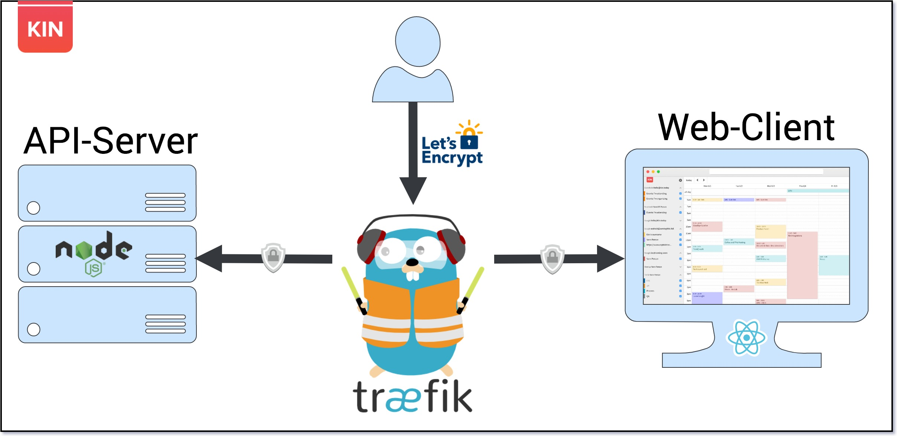

| **Web-Client** | [](https://travis-ci.org/beevelop/docker-kin-client) [](https://links.beevelop.com/d-kin-client) [](https://links.beevelop.com/d-kin-client) [](https://links.beevelop.com/d-kin-client) [](https://github.com/beevelop/docker-kin-client/releases) |
|------------|---|
| **API-Server** | [](https://travis-ci.org/beevelop/docker-kin-server) [](https://links.beevelop.com/d-kin-server) [](https://links.beevelop.com/d-kin-server) [](https://links.beevelop.com/d-kin-server) [](https://github.com/beevelop/docker-kin-server/releases) |

# Kin Calendar for Docker :whale:
> This is the meta repository for the [kin-api-server](https://github.com/beevelop/docker-kin-server) and the [kin-web-client](https://github.com/beevelop/docker-kin-client) images. The provided configuration allows you to quickly get started with your selfhosted Kin Calendar. Keep in mind that the current implementation should not be considered production-ready and is mainly intended for development and exploratory purposes. :hankey:



## :rocket: Quick start
```
git clone https://github.com/beevelop/docker-kin && cd docker-kin
$EDITOR .env
$EDITOR kin.env
docker-compose up
```

## :wrench: Configuration
Traefik is currently configured to do the ACME authentication for the *Let's Encrypt* certificates with Cloudflare. Please consult the [Traefik Documentation](https://docs.traefik.io/toml/) to change this setting to your preferences.

- `.env`: ENVs for Docker Compose
  - `API_SERVER` (e.g. `kin-api-server.example.com`): Domain the API-Server should be reachable at.
  - `WEB_CLIENT` (e.g. `kin-web-client.example.com`): Domain the Web-Client should be reachable at.
  - `CLOUDFLARE_EMAIL` (e.g. `your-cloudflare-user@example.com`): Your CloudFlare username
  - `CLOUDFLARE_API_KEY` (e.g. `abcdefghijklmnopqrstuvwxyz0123456789a`): Your [CloudFlare API Key](https://www.cloudflare.com/a/account/my-account)

- `kin.env`: bare-minimum ENVs for the API-Server (all of those are required)
  - `EXPRESS_SECRET` (e.g. `1234567890abcdefghijl`): Random secret (for JWT, etc.)
  - `GOOGLE_CLIENT_ID` (e.g. `123456789012-abcdefghijklmnopqrstuvwxyz123589.apps.googleusercontent.com`)
  - `GOOGLE_CLIENT_SECRET` (e.g. `abcdefgh1234-ijklmnopqrs`)
  - `FACEBOOK_CLIENT_SECRET` (e.g. `1234567890abcdefghijklmno1234567`)
  - `FACEBOOK_CLIENT_ID` (e.g. `1234567890123456`)

Please refer to the respective image repositories for further instructions and configuration stuff:
- [Web-Client at beevelop/docker-kin-client](https://github.com/beevelop/docker-kin-client)
- [API-Server at beevelop/docker-kin-server](https://github.com/beevelop/docker-kin-server)

## :warning: Warning
This project is still very early. Things **will definitely break** from time to time (e.g. through incompatible upgrades). Your feedback is nonetheless greatly appreciated.

---

[](https://beevelop.com)